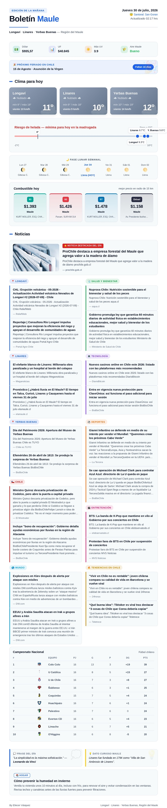

# 📰 Boletín automático — Longaví / Linares / Yerbas Buenas

Bot que corre en GitHub Actions y te manda por Telegram, todos los días a las
**9:00** y a las **21:00** (hora de Chile), un boletín en **PDF** con:

- Noticia destacada del día
- Noticias locales de Longaví, Linares y Yerbas Buenas
- 10 categorías de noticias: locales, Chile, Mundo, Salud, Tecnología,
  Deportes, Entretención y Tendencias
- Clima de las tres localidades y aviso de riesgo de heladas
- Precios de combustible (mejor precio en un radio de 15 km / comparador)
- Indicadores económicos del día (UF y Dólar)
- Próximo feriado en Chile
- Fase lunar semanal
- Tabla de posiciones del fútbol chileno
- Frase del día y un dato curioso de la Región del Maule
- Tips Útiles de distintas categorías, Educación, Salud Hogar entre otros

No necesita servidor propio: todo corre gratis en GitHub Actions.

**Formato:** cada envío llega como **un solo mensaje de Telegram**, un
documento PDF.

La edición de las **9:00** muestra el clima y la temperatura del día en
curso. Con una paleta de colores clara.
La edición de las **21:00** muestra el pronóstico para la madrugada
y el día siguiente, para que sirva como boletín "para mañana". Con una paleta de colores oscura.

---

## 1. Crear tu bot de Telegram

1. En Telegram, habla con **@BotFather**.
2. Envía `/newbot`, ponle un nombre (ej: `Boletín Maule`) y un usuario que
   termine en `bot` (ej: `boletin_maule_bot`).
3. BotFather te entrega un **token**, algo como
   `123456789:AAExxxxxxxxxxxxxxxxxxxxxxxxxxxxxxxxx`. Guárdalo.
4. Ahora necesitas tu **chat_id**:
   - Búscate a ti mismo (o crea un grupo/canal) y mándale un mensaje cualquiera a tu bot recién creado.
   - Abre en el navegador:
     `https://api.telegram.org/bot<TU_TOKEN>/getUpdates`
   - Busca el campo `"chat":{"id":...}` — ese número es tu `chat_id`.

> Si prefieres un canal en vez de un chat privado, agrega el bot como
> administrador del canal y usa el id del canal (normalmente empieza con `-100`).

---

## 2. Subir este proyecto a GitHub

1. Crea un repositorio nuevo en GitHub (puede ser privado).
2. Sube todos estos archivos manteniendo la misma estructura de carpetas
   (`.github/workflows/noticias.yml` debe quedar en esa ruta exacta).

Desde tu computador, dentro de esta carpeta:

```
git init
git add .
git commit -m "Boletín automático inicial"
git branch -M main
git remote add origin https://github.com/TU_USUARIO/TU_REPO.git
git push -u origin main
```

---

## 3. Configurar los "Secrets" en GitHub

En tu repositorio: **Settings → Secrets and variables → Actions → New repository secret**

Crea estos dos (obligatorios):

| Nombre               | Valor                         |
| --------------------- | ----------------------------- |
| `TELEGRAM_BOT_TOKEN`  | el token que te dio BotFather |
| `TELEGRAM_CHAT_ID`    | tu chat_id                    |

Y estos otros (opcionales, ver sección de combustibles más abajo):

| Nombre          | Valor                                       |
| ---------------- | -------------------------------------------- |
| `CNE_EMAIL`      | correo de tu cuenta gratuita en api.cne.cl   |
| `CNE_PASSWORD`   | contraseña de esa cuenta                     |

Los secrets se inyectan al script como variables de entorno directamente
desde el workflow (`env:` en `noticias.yml`), nunca quedan escritos en el
código ni en los logs.

---

## 4. Probarlo

Ve a la pestaña **Actions** de tu repositorio → selecciona el workflow
**"Enviar Noticias Boletin"** → botón **"Run workflow"**. Esto lo fuerza a
enviar de inmediato, sin esperar a las 9:00 o 21:00, para que revises que
todo llegue bien a Telegram.

Una vez probado, el workflow queda corriendo solo, todos los días.
> El workflow se ejecuta cada hora (`cron: '0 12,13,0,1 * * *'`) y revisa
> internamente si en Chile son las 9:00 o las 21:00 antes de enviar algo.
> Esto es a propósito: el cron cubre tanto horario de verano como de
> invierno (UTC-3 / UTC-4), así el horario se ajusta solo cuando Chile
> cambia de horario, sin que tengas que tocar el archivo.

---

## 5. Sobre los precios de combustible ⛽

La fuente es la **API oficial de la CNE** (<https://api.cne.cl/apidocs>), la
misma que usa la app "Bencina en Línea". No usa `auth_key`: se autentica con
correo y contraseña de una cuenta gratuita (`POST /api/login`), lo que
entrega un token temporal.

1. Entra a <https://api.cne.cl/register> y crea una cuenta gratuita (correo + contraseña).
2. Agrega esas credenciales como secrets `CNE_EMAIL` y `CNE_PASSWORD` (paso 3 de arriba).

El script hace login automáticamente, guarda el token durante esa ejecución
y consulta `GET /api/v4/estaciones`. Como la API no entrega la comuna de
cada estación, el filtro por ciudad se hace por **cercanía geográfica**: se
buscan estaciones dentro de un radio (por defecto 15 km, variable
`RADIO_KM_COMBUSTIBLE`) alrededor de las coordenadas de cada localidad, y se
muestra el precio más bajo encontrado.

Mientras no configures `CNE_EMAIL`/`CNE_PASSWORD` — o si no hay ninguna
estación dentro del radio — el boletín igual funciona, solo omite esa
sección con datos en vivo.

---

## 6. Personalizar

Todo el contenido se arma en `scripts/enviar_noticias.py`. Las variables
principales están al inicio del archivo:

- **Ciudades**: diccionario `CIUDADES` — agrega/quita localidades y sus
  coordenadas (lat/lon).
- **Horarios de envío**: `HORAS_DE_ENVIO = {9, 21}`.
- **Umbral de helada**: `UMBRAL_HELADA_C = 3.0` (°C).
- **Radio de búsqueda de combustible**: `RADIO_KM_COMBUSTIBLE = 15` (km).
- **Equipo de fútbol destacado**: `EQUIPO_DESTACADO` — resalta una fila en
  la tabla de posiciones (ej. `"Universidad de Chile"`, `"Colo-Colo"`).
- **Cantidad de noticias por categoría**: se define directamente en el
  diccionario `datos_noticias` dentro de `main_async()` — cada categoría
  usa `buscar_noticias(query, n)` o `noticias_tema(tema, n)`, donde `n` es
  el número de noticias a traer (por defecto 2 en cada una). Para cambiar
  cuántas noticias trae una sección, edita ese número directamente ahí.
- **Búsquedas de noticias locales**: funciones `buscar_noticias()` y
  `noticias_tema()` — usan el RSS de Google Noticias
  (`news.google.com/rss/search` y `.../rss/headlines/section/topic/`).
  Puedes afinar las consultas, por ejemplo agregando `"Región del Maule"`
  para filtrar mejor los resultados locales.
- **Diseño del boletín**: la plantilla HTML/CSS que se convierte en imagen
  vive en `renderizar_plantilla_html()`, con temas visuales distintos para
  la edición de mañana (`CSS_MANANA`) y de noche (`CSS_NOCHE`).

---
## Demostración




## By Eliecer Vásquez
Longaví · Linares · Yerbas Buenas, Región del Maule
